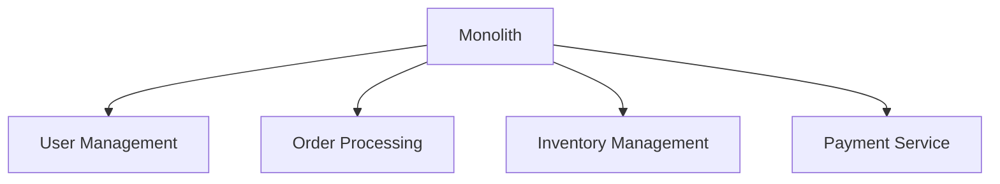

# Migrating Legacy Monolith to Microservices Architecture

This guide provides a systematic approach to breaking down a monolithic application into microservices while ensuring business continuity. We'll cover infrastructure setup, service extraction, deployment strategies, and monitoring.

## Prerequisites
- AWS Account with appropriate IAM permissions
- Docker installed locally
- AWS CLI configured
- Terraform installed
- Existing monolithic application (Example using a Spring Boot application)

## Infrastructure Setup

### 1. VPC and Network Configuration
A well-structured Virtual Private Cloud (VPC) is the foundation of our microservices architecture. This setup creates isolated network segments for different environments and ensures secure communication between services.

```hcl
module "vpc" {
  source = "terraform-aws-modules/vpc/aws"
  
  name = "microservices-vpc"
  cidr = "10.0.0.0/16"
  
  azs             = ["us-west-2a", "us-west-2b"]
  private_subnets = ["10.0.1.0/24", "10.0.2.0/24"]
  public_subnets  = ["10.0.101.0/24", "10.0.102.0/24"]
  
  enable_nat_gateway = true
}
```

Key aspects:
- Separate public and private subnets for security
- Multi-AZ deployment for high availability
- NAT gateway for secure outbound traffic
- CIDR ranges planned for future scaling

### 2. ECS Cluster Setup
Amazon ECS (Elastic Container Service) provides the runtime environment for our microservices. Using Fargate, we can run containers without managing the underlying infrastructure.

```hcl
resource "aws_ecs_cluster" "main" {
  name = "microservices-cluster"
  
  setting {
    name  = "containerInsights"
    value = "enabled"
  }
}

resource "aws_ecs_cluster_capacity_providers" "main" {
  cluster_name = aws_ecs_cluster.main.name
  
  capacity_providers = ["FARGATE"]
  
  default_capacity_provider_strategy {
    base              = 1
    weight            = 100
    capacity_provider = "FARGATE"
  }
}
```

Benefits of this configuration:
- Serverless container execution with Fargate
- Automatic scaling based on demand
- Container insights for monitoring
- Pay-per-use pricing model

## Domain Analysis & Service Extraction

### 1. Domain Identification
Domain-Driven Design (DDD) helps identify bounded contexts within the monolith. This diagram shows the major domains that will become independent microservices.



Each domain represents:
- Independent business capability
- Clear ownership boundaries
- Minimal dependencies between services
- Separate data ownership

### 2. Data Model Separation
Database separation is crucial for service autonomy. Each service gets its own database to ensure loose coupling and independent scaling.

```sql
-- Example of database separation
CREATE DATABASE user_management;
CREATE DATABASE order_processing;
CREATE DATABASE inventory;
```

Database considerations:
- Data ownership per service
- Independent scaling
- Separate backup strategies
- Migration path for existing data

### 3. Service Definition
Kubernetes service definitions expose our microservices to other components in the cluster while providing load balancing and service discovery.

```yaml
# user-service.yaml
apiVersion: v1
kind: Service
metadata:
  name: user-service
spec:
  selector:
    app: user-service
  ports:
    - protocol: TCP
      port: 80
      targetPort: 8080
```

Service features:
- Internal load balancing
- DNS-based service discovery
- Health check integration
- Port mapping configuration

## CI/CD Pipeline Implementation

### 1. GitHub Actions Workflow
Automated deployment pipelines ensure consistent and reliable service deployment. This workflow builds and deploys services to AWS.

```yaml
name: Deploy Microservice

on:
  push:
    branches: [ main ]

jobs:
  deploy:
    runs-on: ubuntu-latest
    steps:
      - uses: actions/checkout@v2
      
      - name: Configure AWS credentials
        uses: aws-actions/configure-aws-credentials@v1
        with:
          aws-access-key-id: ${{ secrets.AWS_ACCESS_KEY_ID }}
          aws-secret-access-key: ${{ secrets.AWS_SECRET_ACCESS_KEY }}
          aws-region: us-west-2
      
      - name: Build and push Docker image
        run: |
          docker build -t user-service .
          aws ecr get-login-password --region us-west-2 | docker login --username AWS --password-stdin ${{ secrets.ECR_REGISTRY }}
          docker tag user-service:latest ${{ secrets.ECR_REGISTRY }}/user-service:latest
          docker push ${{ secrets.ECR_REGISTRY }}/user-service:latest
```

Pipeline highlights:
- Automated builds on main branch
- Secure credential handling
- Docker image versioning
- ECR integration for container registry

## Feature Flag Implementation

### 1. LaunchDarkly Setup
Feature flags enable gradual rollout and risk mitigation. They allow us to control the migration at a granular level and quickly rollback if needed.

```java
LDClient ldClient = new LDClient("sdk-key");

boolean showFeature = ldClient.boolVariation("new-service-enabled", user, false);
if (showFeature) {
    // Route to new microservice
} else {
    // Route to monolith
}
```

Feature flag benefits:
- Gradual user migration
- A/B testing capability
- Instant rollback option
- User-specific targeting

## Monitoring and Observability

### 1. CloudWatch Dashboard
Comprehensive monitoring is crucial during and after migration. This dashboard provides visibility into service health and performance.

```hcl
resource "aws_cloudwatch_dashboard" "main" {
  dashboard_name = "microservices-dashboard"
  
  dashboard_body = jsonencode({
    widgets = [
      {
        type   = "metric"
        width  = 12
        height = 6
        
        properties = {
          metrics = [
            ["AWS/ECS", "CPUUtilization", "ServiceName", "user-service"]
          ]
          period = 300
          region = "us-west-2"
        }
      }
    ]
  })
}
```

Monitoring aspects:
- Resource utilization metrics
- Service health indicators
- Cost tracking
- Performance comparison

## Gradual Migration Strategy
A phased approach to migration reduces risk and allows for learning and adjustment. Each step builds confidence in the new architecture.

1. Start with stateless services - These are easier to migrate and validate
2. Implement strangler fig pattern - Gradually replace monolith functionality
3. Use feature flags for traffic control - Control user exposure to new services
4. Monitor and validate metrics - Ensure performance and reliability
5. Gradually increase traffic to new services - Build confidence in the new system

## Rollback Plan
A comprehensive rollback strategy is essential for risk management. This plan ensures we can quickly revert to the monolith if needed.

1. Feature flag disable procedure - Instant traffic redirection
2. Database rollback scripts - Data consistency preservation
3. DNS fallback configuration - Quick service routing changes
4. Monitoring alert thresholds - Early warning system
5. Communication plan template - Stakeholder notification process

## Success Metrics
Quantifiable metrics help track migration progress and success. These indicators guide decision-making throughout the migration.

- Response time comparison - Performance validation
- Error rate monitoring - Reliability tracking
- Resource utilization - Infrastructure efficiency
- Cost per transaction - Financial impact
- Deployment frequency - Development velocity